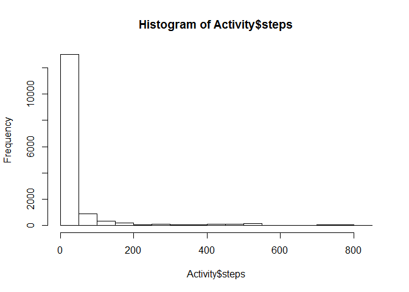
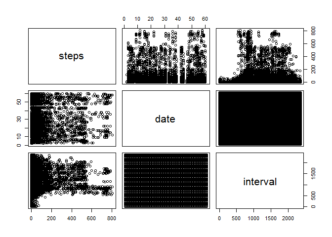

# Reproducible Research: Peer Assessment 1
S. Schwarzbek  
Thursday, October 15, 2014  
### The Task
Create a "literate programming" style document analyzing fitness steps count data. Many corporations are now providing these as fitness encourgement through contracts with "Virgin Health Miles" as one source.  
We make sure our environment has the expected tools.


```r
library(knitr)
library(caret)
```

```
## Loading required package: lattice
## Loading required package: ggplot2
```


##Assignment

### Loading and preprocessing the data
Dataset: Activity monitoring data

```r
Activity <- read.csv("C:\\Users\\steve\\Desktop\\Coursera\\DataScience\\Reproducible\\activity.csv")
```
The variables included in this dataset are:  
steps: Number of steps taking in a 5-minute interval (missing values are coded as NA )  
date: The date on which the measurement was taken in YYYY-MM-DD format  
interval: Identifier for the 5-minute interval in which measurement was taken  
The dataset is stored in a comma-separated-value (CSV) file and there are a total of 17,568 observations in this dataset.

```r
summary(Activity)
```

```
##      steps               date          interval   
##  Min.   :  0.0   2012-10-01:  288   Min.   :   0  
##  1st Qu.:  0.0   2012-10-02:  288   1st Qu.: 589  
##  Median :  0.0   2012-10-03:  288   Median :1178  
##  Mean   : 37.4   2012-10-04:  288   Mean   :1178  
##  3rd Qu.: 12.0   2012-10-05:  288   3rd Qu.:1766  
##  Max.   :806.0   2012-10-06:  288   Max.   :2355  
##  NA's   :2304    (Other)   :15840
```

```r
hist(Activity$steps)
```

 

```r
plot(Activity)
```

 

### What is mean total number of steps taken per day?


### What is the average daily activity pattern?


### Imputing missing values


### Are there differences in activity patterns between weekdays and weekends?
