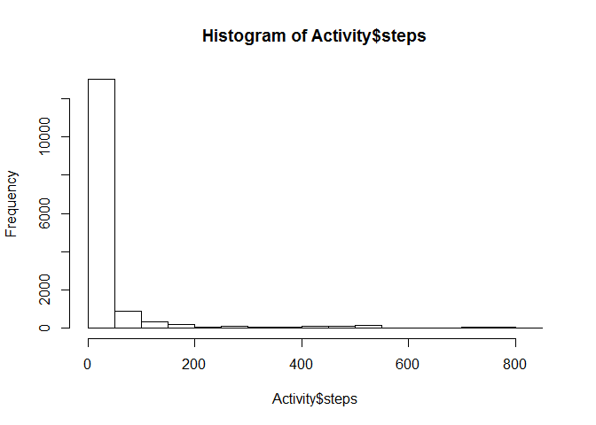
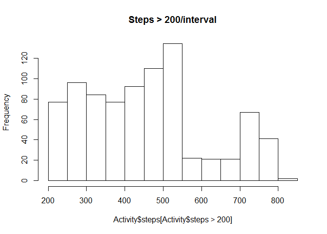
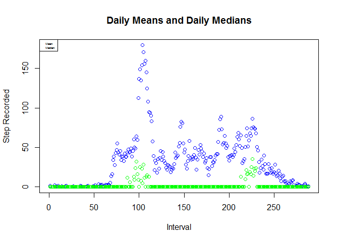
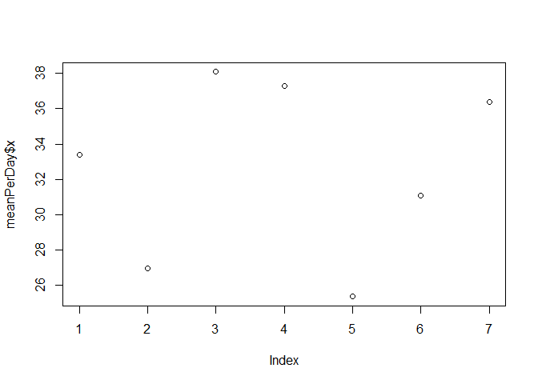
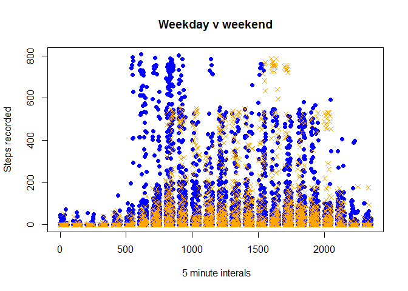
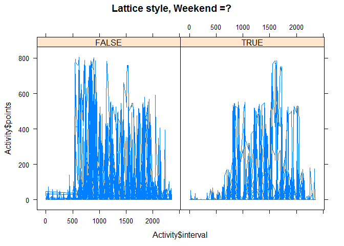

# Reproducible Research: Peer Assessment 1
S. Schwarzbek  
Sunday, October 19, 2014  
### The Task
Create a "literate programming" style document analyzing fitness steps count data. Many corporations are now providing these as fitness encouragement through contracts with "Virgin Health Miles" for example.


We make sure our environment has the expected tools.


```r
library(knitr)
library(caret)
```

```
## Loading required package: lattice
## Loading required package: ggplot2
```

"caret" calls "lattice" and "ggplot."

##Assignment

### Loading and preprocessing the data
Dataset: Activity monitoring data

```r
if( ! exists("Activity")) {
  Activity <- read.csv("C:\\Users\\steve\\Desktop\\Coursera\\DataScience\\Reproducible\\activity.csv")
  }
```
The variables included in this dataset are:  
steps: Number of steps taking in a 5-minute interval (missing values are coded as NA )  
date: The date on which the measurement was taken in YYYY-MM-DD format  
interval: Identifier for the 5-minute interval in which measurement was taken  
The dataset is stored in a comma-separated-value (CSV) file and there are a total of 17,568 observations in this dataset.

```r
summary(Activity)
```

```
##      steps               date          interval   
##  Min.   :  0.0   2012-10-01:  288   Min.   :   0  
##  1st Qu.:  0.0   2012-10-02:  288   1st Qu.: 589  
##  Median :  0.0   2012-10-03:  288   Median :1178  
##  Mean   : 37.4   2012-10-04:  288   Mean   :1178  
##  3rd Qu.: 12.0   2012-10-05:  288   3rd Qu.:1766  
##  Max.   :806.0   2012-10-06:  288   Max.   :2355  
##  NA's   :2304    (Other)   :15840                 
##       Time                         Day                points     
##  Min.   :2012-10-01 00:00:00   Length:17568       Min.   :  0.0  
##  1st Qu.:2012-10-16 00:00:00   Class :character   1st Qu.:  0.0  
##  Median :2012-10-31 00:00:00   Mode  :character   Median :  0.0  
##  Mean   :2012-10-31 00:25:34                      Mean   : 32.5  
##  3rd Qu.:2012-11-15 00:00:00                      3rd Qu.:  0.0  
##  Max.   :2012-11-30 00:00:00                      Max.   :806.0  
## 
```

```r
Activity$Time <- strptime(Activity$date,"%Y-%m-%d")
Activity$Day <- weekdays(Activity$Time)
hist(Activity$steps)
```

 

```r
hist(Activity$steps[Activity$steps > 200], main = "Steps > 200/interval")
```

 
We look at the data away from zero to see if there is structure.For this analysis, we'll consider teh entire case,and not just those intervals that have "deliberate activity." As we'll note later, many NA's are likely to be "inactive intervals," often sleep.

```r
#plot(Activity[,c(1,4,3)])
meanDay <- aggregate(Activity$points, list( Activity$interval), mean)
maxDay <- aggregate(Activity$points, list( Activity$interval), max)
medDay <- aggregate(Activity$points, list( Activity$interval), median)
plot(meanDay$x, col = "blue",
     main = "Daily Means and Daily Medians",
     ylab = "Step Recorded",
     xlab = "Interval"
     )

points(medDay$x, col = "green")
legend("topleft", c("Mean", "Median"), col = c("blue", "green"), cex = 0.4)
```

 

```r
Activity$points <- Activity$steps
Activity$points[is.na(Activity$steps)] <- 0
```


### What is mean total number of steps taken per day?

```r
meanPerDay <- aggregate(Activity$points, list(Activity$Day), mean)
plot(meanPerDay$x)
```

 

### What is the average daily activity pattern?

```r
#mDay <- aggregate(Activity$points, list(Activity$intrval), mean)
#plot(mDay$x)
```

Most of the early intervals are NA or small values. If we assume that our intervals start at midnight, the subject is ikely sleeping. Note that the weekend/weekday charts indicate "sleeping in" occurs regularly.


### Imputing missing values
One of the first possibilities for the treatment of NA values is "No Activity," likely the fitness device not worn, inoperable, or has an overflow condition. We will count these intervals as steps = 0, but retain the original columns also
This lowers the mean and median.

```r
Activity$points <- Activity$steps
Activity$points[is.na(Activity$steps)] <- 0
summary(Activity)
```

```
##      steps               date          interval   
##  Min.   :  0.0   2012-10-01:  288   Min.   :   0  
##  1st Qu.:  0.0   2012-10-02:  288   1st Qu.: 589  
##  Median :  0.0   2012-10-03:  288   Median :1178  
##  Mean   : 37.4   2012-10-04:  288   Mean   :1178  
##  3rd Qu.: 12.0   2012-10-05:  288   3rd Qu.:1766  
##  Max.   :806.0   2012-10-06:  288   Max.   :2355  
##  NA's   :2304    (Other)   :15840                 
##       Time                         Day                points     
##  Min.   :2012-10-01 00:00:00   Length:17568       Min.   :  0.0  
##  1st Qu.:2012-10-16 00:00:00   Class :character   1st Qu.:  0.0  
##  Median :2012-10-31 00:00:00   Mode  :character   Median :  0.0  
##  Mean   :2012-10-31 00:25:34                      Mean   : 32.5  
##  3rd Qu.:2012-11-15 00:00:00                      3rd Qu.:  0.0  
##  Max.   :2012-11-30 00:00:00                      Max.   :806.0  
## 
```


### Are there differences in activity patterns between weekdays and weekends?

```r
Weekend <- Activity[Activity$Day == "Sunday" | Activity$Day == "Saturday",]
Weekday <- Activity[Activity$Day != "Sunday" & Activity$Day != "Saturday",]
plot(Weekday$interval, Weekday$steps, 
     col = "blue", 
     main = "Weekday v weekend",
     xlab = " 5 minute interals",
     ylab = "Steps recorded",
     pch = 16)
points(Weekend$interval, Weekend$steps, col = "orange", pch = 4)
```

 

```r
xyplot(Activity$points ~ Activity$interval | c(Activity$Day == "Saturday" | Activity$Day =="Sunday", Activity$Day != "Saturday" & Activity$Day != "Sunday"), type = "l",
       main = "Lattice style, Weekend =?",
      )
```

 


