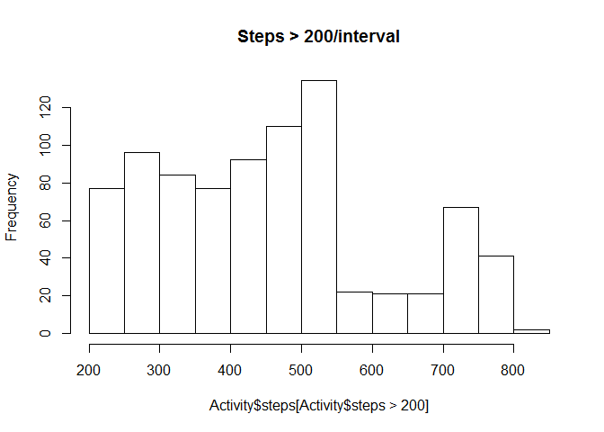
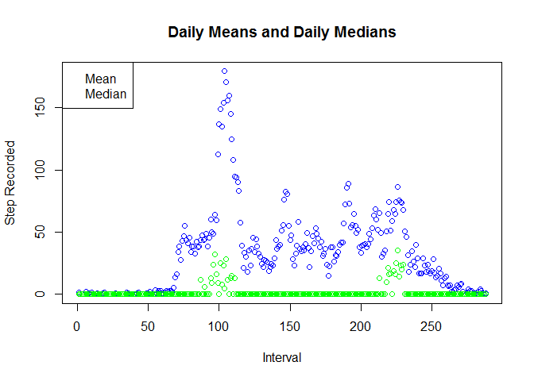
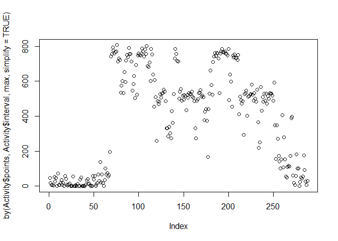
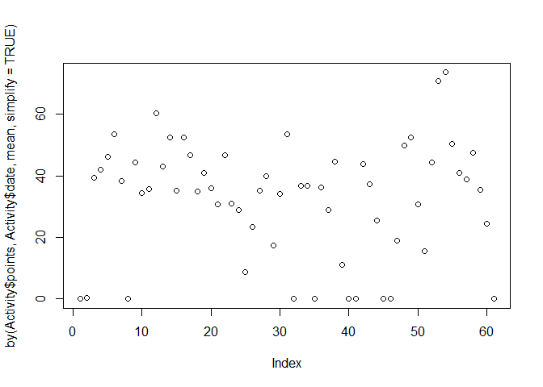

# Reproducible Research: Peer Assessment 1
S. Schwarzbek  
Thursday, October 15, 2014  
### The Task
Create a "literate programming" style document analyzing fitness steps count data. Many corporations are now providing these as fitness encourgement through contracts with "Virgin Health Miles" for example.


We make sure our environment has the expected tools.


```r
library(knitr)
library(caret)
```

```
## Loading required package: lattice
## Loading required package: ggplot2
```

"caret" calls "lattice" and "ggplot."

##Assignment

### Loading and preprocessing the data
Dataset: Activity monitoring data

```r
if( ! exists("Activity")) {
  Activity <- read.csv("C:\\Users\\steve\\Desktop\\Coursera\\DataScience\\Reproducible\\activity.csv")
  }
```
The variables included in this dataset are:  
steps: Number of steps taking in a 5-minute interval (missing values are coded as NA )  
date: The date on which the measurement was taken in YYYY-MM-DD format  
interval: Identifier for the 5-minute interval in which measurement was taken  
The dataset is stored in a comma-separated-value (CSV) file and there are a total of 17,568 observations in this dataset.

```r
summary(Activity)
```

```
##      steps               date          interval   
##  Min.   :  0.0   2012-10-01:  288   Min.   :   0  
##  1st Qu.:  0.0   2012-10-02:  288   1st Qu.: 589  
##  Median :  0.0   2012-10-03:  288   Median :1178  
##  Mean   : 37.4   2012-10-04:  288   Mean   :1178  
##  3rd Qu.: 12.0   2012-10-05:  288   3rd Qu.:1766  
##  Max.   :806.0   2012-10-06:  288   Max.   :2355  
##  NA's   :2304    (Other)   :15840                 
##       Time                         Day                points     
##  Min.   :2012-10-01 00:00:00   Length:17568       Min.   :  0.0  
##  1st Qu.:2012-10-16 00:00:00   Class :character   1st Qu.:  0.0  
##  Median :2012-10-31 00:00:00   Mode  :character   Median :  0.0  
##  Mean   :2012-10-31 00:25:34                      Mean   : 32.5  
##  3rd Qu.:2012-11-15 00:00:00                      3rd Qu.:  0.0  
##  Max.   :2012-11-30 00:00:00                      Max.   :806.0  
## 
```

```r
Activity$Time <- strptime(Activity$date,"%Y-%m-%d")
Activity$Day <- weekdays(Activity$Time)
hist(Activity$steps)
```

 

```r
hist(Activity$steps[Activity$steps > 50], main = "Steps > 50/interval")
```

 

```r
hist(Activity$steps[Activity$steps > 200], main = "Steps > 200/interval")
```

 


```r
#plot(Activity[,c(1,4,3)])
meanDay <- aggregate(Activity$points, list( Activity$interval), mean)
maxDay <- aggregate(Activity$points, list( Activity$interval), max)
medDay <- aggregate(Activity$points, list( Activity$interval), median)
plot(meanDay$x, col = "blue",
     main = "Daily Means and Daily Medians",
     ylab = "Step Recorded",
     xlab = "Interval"
     )

points(medDay$x, col = "green")
legend("topleft", c("Mean", "Median"), col = c("blue", "green"))
```

 

```r
Activity$points <- Activity$steps
Activity$points[is.na(Activity$steps)] <- 0

#plot(by(Activity$points, Activity$interval, sum, simplify=TRUE))
plot(by(Activity$points, Activity$interval, max, simplify=TRUE))
```

 

```r
#points(by(Activity$points, Activity$interval, min, na.rm = TRUE), col="blue"))
#points(by(Activity$points, Activity$interval, mean, na.rm = TRUE), col="red"))
#points(by(Activity$points, Activity$interval, median, na.rm = TRUE), col="green"))
```


### What is mean total number of steps taken per day?


### What is the average daily activity pattern?

```r
plot(by(Activity$points, Activity$date, mean, simplify=TRUE))
```

 


### Imputing missing values
One of the first possibilities for the treatment of NA values is "No Activity," likely the fitness device not worn, inoperable, or has an overflow condition. We will count these intervals as stpes = 0, but retain the original columns also

```r
Activity$points <- Activity$steps
Activity$points[is.na(Activity$steps)] <- 0
summary(Activity)
```

```
##      steps               date          interval   
##  Min.   :  0.0   2012-10-01:  288   Min.   :   0  
##  1st Qu.:  0.0   2012-10-02:  288   1st Qu.: 589  
##  Median :  0.0   2012-10-03:  288   Median :1178  
##  Mean   : 37.4   2012-10-04:  288   Mean   :1178  
##  3rd Qu.: 12.0   2012-10-05:  288   3rd Qu.:1766  
##  Max.   :806.0   2012-10-06:  288   Max.   :2355  
##  NA's   :2304    (Other)   :15840                 
##       Time                         Day                points     
##  Min.   :2012-10-01 00:00:00   Length:17568       Min.   :  0.0  
##  1st Qu.:2012-10-16 00:00:00   Class :character   1st Qu.:  0.0  
##  Median :2012-10-31 00:00:00   Mode  :character   Median :  0.0  
##  Mean   :2012-10-31 00:25:34                      Mean   : 32.5  
##  3rd Qu.:2012-11-15 00:00:00                      3rd Qu.:  0.0  
##  Max.   :2012-11-30 00:00:00                      Max.   :806.0  
## 
```


### Are there differences in activity patterns between weekdays and weekends?
boxplot(Activity$interval ~ Activity$points, pch=".", col = "blue", factor) 
plot()

# From the Readme:
### What is mean total number of steps taken per day?

For this part of the assignment, you can ignore the missing values in
the dataset.

1. Make a histogram of the total number of steps taken each day

2. Calculate and report the **mean** and **median** total number of steps taken per day


### What is the average daily activity pattern?

1. Make a time series plot (i.e. `type = "l"`) of the 5-minute interval (x-axis) and the average number of steps taken, averaged across all days (y-axis)

2. Which 5-minute interval, on average across all the days in the dataset, contains the maximum number of steps?


### Imputing missing values

Note that there are a number of days/intervals where there are missing
values (coded as `NA`). The presence of missing days may introduce
bias into some calculations or summaries of the data.

1. Calculate and report the total number of missing values in the dataset (i.e. the total number of rows with `NA`s)

2. Devise a strategy for filling in all of the missing values in the dataset. The strategy does not need to be sophisticated. For example, you could use the mean/median for that day, or the mean for that 5-minute interval, etc.

3. Create a new dataset that is equal to the original dataset but with the missing data filled in.

4. Make a histogram of the total number of steps taken each day and Calculate and report the **mean** and **median** total number of steps taken per day. Do these values differ from the estimates from the first part of the assignment? What is the impact of imputing missing data on the estimates of the total daily number of steps?


### Are there differences in activity patterns between weekdays and weekends?

```r
Weekend <- Activity[Activity$Day == "Sunday" | Activity$Day == "Saturday",]
Weekday <- Activity[Activity$Day != "Sunday" & Activity$Day != "Saturday",]
plot(Weekday$interval, Weekday$steps, 
     col = "blue", 
     main = "Weekday v weekend",
     xlab = " 5 minute interals",
     ylab = "Steps recorded",
     pch = 16)
points(Weekend$interval, Weekend$steps, col = "orange", pch = 4)
```

 

```r
xyplot(Activity$points ~ Activity$interval | c(Activity$Day == "Saturday" | Activity$Day =="Sunday", Activity$Day != "Saturday" & Activity$Day != "Sunday"), type = "l",
       main = "Lattice style, Weekend =?",
      )
```

 
For this part the `weekdays()` function may be of some help here. Use
the dataset with the filled-in missing values for this part.

1. Create a new factor variable in the dataset with two levels -- "weekday" and "weekend" indicating whether a given date is a weekday or weekend day.

1. Make a panel plot containing a time series plot (i.e. `type = "l"`) of the 5-minute interval (x-axis) and the average number of steps taken, averaged across all weekday days or weekend days (y-axis). The plot should look something like the following, which was created using **simulated data**:

 


